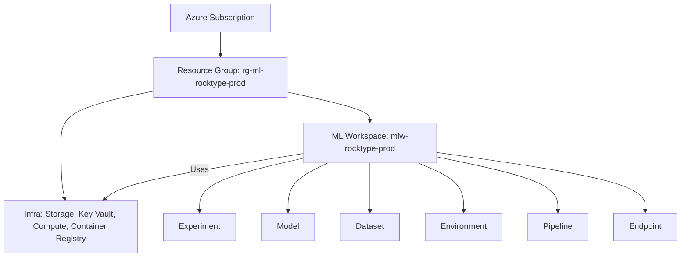

# Azure ML documentation

<!-- TODO: Implement the Titanic example (standard ML) and a computer vision task, with a "geotechnical" open access database. More about the titanic example here: https://medium.com/henkel-data-and-analytics/how-to-use-azure-ml-studio-an-eye-opening-model-training-tutorial-for-beginners-from-henkels-data-5035ee10a6d2 -->

Azure ML is a powerful tool for machine learning and data science. It provides a comprehensive set of features for building, training, and deploying machine learning models. In this document, we will cover the basics of Azure ML, including how to set up your environment, create and manage resources, and train and deploy models. We will exemplify the use of Azure ML with two examples:

- Conventional ML: Titanic survival prediction
- Computer vision: Classification of rock type in images

## Table of Contents

- [Azure ML Documentation](#azure-ml-documentation)
  - [Table of Contents](#table-of-contents)
  - [Related Azure Concepts](#related-azure-concepts)
    - [Azure Portal](#azure-portal)
    - [Azure ML](#azure-ml)
      - [Batch vs Real-Time Inference](#batch-vs-real-time-inference)
    - [Azure AI Foundry Portal](#azure-ai-foundry-portal)
    - [Azure DevOps](#azure-devops)
  - [Tools and System Setup](#tools-and-system-setup)
    - [Azure Account](#azure-account)
    - [Azure Subscription](#azure-subscription)
    - [Azure CLI](#azure-cli)
    - [Azure App Service](#azure-app-service)
    - [Azure ML Python SDKv2](#azure-ml-python-sdkv2)
    - [VSCode Integrated with Azure ML](#vscode-integrated-with-azure-ml)
  - [Azure ML Resources and Assets](#azure-ml-resources-and-assets)
    - [Resources vs Assets](#resources-vs-assets)
    - [Hierarchy Overview](#hierarchy-overview)
    - [What Belongs Where?](#what-belongs-where)
    - [Recommended Project Structure](#recommended-project-structure)
    - [Naming Conventions](#naming-conventions)
    - [Tagging](#tagging)
    - [Inside the Workspace](#inside-the-workspace)
    - [Workspace Administration](#workspace-administration)
    - [Deployment and Pipelines](#deployment-and-pipelines)
    - [General Best Practices](#general-best-practices)
    - [Visual Summary](#visual-summary)
    - [Billing and Lifecycle Management](#billing-and-lifecycle-management)
  - [Resources - Setting Things Up](#resources---setting-things-up)
    - [Setting Up and Connecting to a Workspace](#setting-up-and-connecting-to-a-workspace)
      - [Setting Up a Workspace](#setting-up-a-workspace)
      - [Content Stored in a Workspace](#content-stored-in-a-workspace)
      - [Connect to a Workspace](#connect-to-a-workspace)
    - [Compute Instance](#compute-instance)
    - [Datastore - Including How to Reference Data in a Datastore](#datastore---including-how-to-reference-data-in-a-datastore)
      - [Prepare and Upload Your Dataset to Azure Blob Storage](#prepare-and-upload-your-dataset-to-azure-blob-storage)
      - [Register the Dataset](#register-the-dataset)
  - [Assets - Setup, Creating and Managing](#assets---setup-creating-and-managing)
    - [Environment](#environment)
    - [Models](#models)
    - [Pipelines](#pipelines)
    - [Component](#component)
  - [Training a Model in Azure ML](#training-a-model-in-azure-ml)
    - [Typical Workflow for Training a Model in Azure ML](#typical-workflow-for-training-a-model-in-azure-ml)
    - [Complete Script for Training a Model in Azure ML](#complete-script-for-training-a-model-in-azure-ml)
  - [Experiment Tracking in Azure ML](#experiment-tracking-in-azure-ml)
    - [MLflow](#mlflow)
    - [Tensorboard](#tensorboard)
  - [Dataset Versioning in Azure ML](#dataset-versioning-in-azure-ml)
    - [Register a Dataset in Azure ML](#register-a-dataset-in-azure-ml)
    - [View Dataset Versions](#view-dataset-versions)
    - [Use a Specific Dataset Version in an Experiment](#use-a-specific-dataset-version-in-an-experiment)
    - [Dataset Versioning in the Experiment Log](#dataset-versioning-in-the-experiment-log)
    - [Benefits of Dataset Versioning](#benefits-of-dataset-versioning)
    - [Updating Datasets](#updating-datasets)
    - [Data Asset Management in Azure ML Studio](#data-asset-management-in-azure-ml-studio)
    - [Integrating with Git and CI/CD](#integrating-with-git-and-cicd)
  - [Example Tutorials](#example-tutorials)
    - [Predicting Titanic Survival](#predicting-titanic-survival)
    - [Rock Joint Detection](#rock-joint-detection)
    - [LabOAI](#laboai)
  - [Learning Resources](#learning-resources)

---

## Related Azure concepts

We start by defining some relevant Azure concepts. This is not a complete list of all Azure concepts, but it is a good starting point for understanding the Azure ecosystem. For a complete list of Azure concepts, please refer to the [Azure documentation](https://learn.microsoft.com/en-us/azure/?view=azure-cli-latest).

### Azure portal

Azure Portal is the web-based interface for managing Azure resources. It provides a user-friendly way to create, configure, and monitor Azure services, including Azure Machine Learning. You can access the Azure Portal at https://portal.azure.com/.

### Azure ML

Azure ML is a cloud-based service for creating, managing, and deploying machine learning models. It provides a centralized place for data scientists and developers to work with all the artifacts for machine learning, including datasets, training scripts, and trained models.

Azure ML make it easy to scale your ML training by harnessing powerful cloud compute resources, such as nodes with several GPU's with lots of memory. Azure ML is for individuals and teams implementing `MLOps` within their organization to bring ML models into production in a secure and auditable production environment. You reach Azure ML through http://ml.azure.com.

Azure ML provides multiple ways to submit ML training jobs.

- Azure CLI extension for machine learning: The ml extension, also referred to as CLI v2.
- Python SDK v2 for Azure Machine Learning.
- REST API: The API that the CLI and SDK are built on.

To train and create an ML model you can also use [Azure ML Designer](https://learn.microsoft.com/en-us/azure/machine-learning/concept-designer?view=azureml-api-2). We will focus on using the Python SDK v2 for Azure Machine Learning in this document. The Python SDK provides a rich set of features for managing Azure ML resources, running experiments, and deploying models directly from your development environment.

To manage the Azure ML resources, we will use the Azure ML Studio. The studio provides a user-friendly way to create and manage machine learning resources, including datasets, compute instances, and models. You can access the [Azure ML Studio](http://ml.azure.com). We will mainly use the Azure ML Studio for managing resources, but will use the Python SDK for training and deploying models.

When a model is trained and registered, it can be deployed to an API endpoint for real-time inferencing or batch inferencing. Azure ML provides a set of tools and services to manage the entire machine learning lifecycle, including data preparation, model training, deployment, and monitoring.

> **ℹ️ Batch vs Real-Time Inference**
>
> - **Batch Inference**: Making predictions on many data points at once, usually on a schedule or triggered manually. It’s typical in offline settings where speed per prediction is not critical.
>   **Examples**: Predicting credit scores for all customers overnight, analyzing sensor logs once per day.
>
> - **Real-Time Inference (Online Inference)**: Making predictions immediately as data arrives, with low latency. It’s used when decisions must be made quickly.
>   **Examples**: Fraud detection during a credit card transaction, personalized recommendations when you visit a website.

Azure ML has a comprehensive documentation. In this documentation for a `code academy course` in MLOps and professional ML development in Azure ML we have tried to simplify the most important parts of Azure ML and to extract the parts which currently are most relevant for NGI.

In this tutorial we have listed the parts in a typical MLOps workflow that is facilitated by Azure ML. We will describe and run these operations mainly in the form of Python scripts, but the experiments, the models and other artifacts will be visualised in the Azure ML Studio.

The main operations carried out in Azure ML Studio are:

- Model processing, training, evaluation by defining reusable ML pipelines. NOTE: You don't need `Airflow` or other orchestration tools to run pipelines in Azure ML. Azure ML has its own orchestration engine.
- Hyperparameter tuning
- Reusable environments for training and deployment
- Model evaluation
- Experiment tracking to mlflow and/or tensorboard
- Dataset versioning
- Model versioning
- Model packaging, registration and deployment, mainly using an API endpoint
- Monitoring of deployed models
- Retraining of deployed models
- Hosting GUI/application for model inferencing using the API endpoint. For this we will mainly use `Azure App Service`, but other options are available, such as `Azure Functions` and `Azure Kubernetes Service (AKS)`.

MLOps steps not covered by Azure ML can be found in the [MLOps](MLOps.md) document in this repo. These steps include: coming...

There are a few other tools which can be accessed through Azure ML Studio, such as `AutoML`, `Data labeling`, and `Azure ML designer`. These tools are not covered in detail in this document, but they can be useful for specific use cases.

#### Azure ML Designer

Azure ML Designer is a drag-and-drop interface for building machine learning models without writing code. It allows users to create and manage machine learning workflows visually. This can be useful for users who are not familiar with programming or prefer a more visual approach to building models. Azure ML Designer provides a set of pre-built modules for common tasks, such as data preprocessing, model training, and evaluation. Users can connect these modules to create a complete machine learning pipeline. Azure ML Designer is a good tool for quickly prototyping machine learning models and workflows.

Reference: https://learn.microsoft.com/en-us/azure/machine-learning/concept-designer?view=azure-ml-py&tabs=python#overview

#### AutoML

AutoML is a feature in Azure Machine Learning that automates the process of building and tuning machine learning models. It helps users quickly create high-quality models without requiring extensive knowledge of machine learning algorithms or hyperparameter tuning. AutoML can automatically select the best algorithm, preprocess the data, and optimize hyperparameters to achieve the best performance. This can save time and effort for data scientists and developers, allowing them to focus on other aspects of their projects. AutoML is particularly useful for users who are new to machine learning or have limited experience with model development. AutoML can also be used as a quick first step to identify the best algorithms and hyperparameters for a specific problem before moving on to more advanced techniques or custom model development.

Reference: https://learn.microsoft.com/en-us/azure/machine-learning/concept-automated-ml?view=azure-ml-py&tabs=python#overview

#### Data labeling

Azure ML Data Labeling is a feature that helps users annotate and label data for machine learning tasks. It provides a user-friendly interface for creating and managing labeling projects, allowing users to upload datasets, define labeling tasks, and collaborate with labelers. Data Labeling supports various types of data, including images, text, and audio. Users can create custom labeling tasks, such as object detection, image classification, and text classification. The labeled data can then be used to train machine learning models in Azure ML. Data Labeling is particularly useful for users who need to prepare large datasets for supervised learning tasks.

Some of you have perhaps heard about `Labelstudio`, which is a popular open-source tool for data labeling. Azure data labelling is a similar tool, but it is integrated into Azure ML and provides a more streamlined experience for users working within the Azure ecosystem.

Reference: https://learn.microsoft.com/en-us/azure/machine-learning/how-to-label-data?view=azureml-api-2

#### References:

- https://learn.microsoft.com/en-us/azure/machine-learning/concept-model-management-and-deployment?view=azureml-api-2
- https://learn.microsoft.com/en-us/azure/machine-learning/?view=azureml-api-2
- https://medium.com/henkel-data-and-analytics/how-to-use-azure-ml-studio-an-eye-opening-model-training-tutorial-for-beginners-from-henkels-data-5035ee10a6d2

### Azure AI Foundry portal

 Azure AI Foundry portal is a unified platform for developing and deploying `generative AI apps` and Azure AI APIs responsibly. It includes a rich set of AI capabilities, simplified user interface and code-first experiences, offering a one-stop shop to build, test, deploy, and manage intelligent solutions. Generative AI development is not the main topic of this document, but it is worth mentioning that Azure AI Foundry portal is a powerful tool for building and deploying generative AI applications. It provides a set of pre-built models and APIs for common tasks, such as text generation, image generation, and speech synthesis. The portal also includes tools for managing and monitoring the performance of your applications. Azure AI Foundry portal is a good choice for users who want to quickly build and deploy generative AI applications in a safe and secure way without having to worry about the underlying infrastructure.

 Reference: https://learn.microsoft.com/en-us/azure/ai-foundry/?view=azure-ai-foundry-portal&tabs=python-sdk#overview
### Azure DevOps

#### Examples

Throughout this documentation we will often refer to an example NGI project called `RockJointDetection`. This project is a machine learning project that aims to detect rock joints in images. The project is used as an example to demonstrate the functionality of Azure ML and how to use it for machine learning projects. The project is available here in Azure Devops: https://dev.azure.com/ngi001/NGI/_git/syntetic_rock_joint_generation_for_ml

## Tools- and system setup

### Azure account

To use Azure ML you need an Azure account. In NGI all employees have an Azure account. You can check if you have an Azure account by logging into the Azure portal at https://portal.azure.com/. If you are logged in, you have an Azure account. If you are not logged in, you can log in with your NGI email address and password. If you dont have an account you can also create a free account at https://go.microsoft.com/fwlink/?linkid=2227353&clcid=0x409&l=en-us&icid=azurefreeaccount. The free account gives you access to a limited set of Azure services for 12 months. You can use the free account to explore Azure ML and other Azure services.

Reference: https://azure.microsoft.com/en-us/pricing/purchase-options/azure-account?icid=azurefreeaccount

### Azure subscription

An Azure subscription is a logical container used to provision resources in Azure. It holds the details of all your resources, such as compute nodes, virtual machines, storage accounts, and databases. Each Azure subscription is associated with a specific Azure account and can be managed through the Azure portal. You can create multiple subscriptions under a single Azure account to organize and manage your resources based on different projects or departments. For this tutorial we have made a subscription called `ngi_mlops_sandbox`. You can check your subscriptions in the Azure portal by clicking on `Subscriptions` in the top menu. Ask IT services (Christian Demeter) to create an Azure subscription for you if you do not have one.

Once you have an Azure account and subscription, you can create an Azure Machine Learning workspace to start building, training, and deploying machine learning models. More about workspaces can be found in the [Workspace](#workspace) section below.

### Azure CLI

Azure CLI is a command-line tool that provides a set of commands for managing Azure resources. You can use Azure CLI to create and manage Azure resources, such as virtual machines, storage accounts, and Azure Machine Learning workspaces. Azure CLI is available for Windows, macOS, and Linux. You can install Azure CLI on your local machine or use the Azure Cloud Shell, which is a browser-based shell that comes pre-installed with Azure CLI. You can also login into Azure CLI using the standard terminal in VSCode using the command: `az login`. This will open a browser window where you can log in with your Azure account.

To install Azure CLI on your local machine, follow the instructions in the Azure CLI installation guide: https://learn.microsoft.com/en-us/cli/azure/install-azure-cli?view=azure-cli-latest


Reference: https://learn.microsoft.com/en-us/azure/machine-learning/how-to-configure-cli?view=azureml-api-2&tabs=public

### Azure APP service

Azure App Service is a fully managed platform for building, deploying, and scaling web apps. It provides a range of features, including support for multiple programming languages, built-in authentication and authorization, and integration with Azure DevOps for continuous deployment. Azure App Service is a good choice for hosting web applications, RESTful APIs, and mobile backends. It allows you to focus on your application code while Azure manages the underlying infrastructure.

You can use Azure App Service to host your machine learning models and APIs. This allows you to deploy your models as web services that can be accessed by other applications or users. Azure App Service provides built-in support for scaling, load balancing, and monitoring, making it easy to manage your deployed models.

Reference: https://learn.microsoft.com/en-us/azure/app-service/overview?view=azure-app-service&tabs=python#overview

### Azure ML Python SDKv2

The Azure ML Python SDK is a set of Python libraries that provide a convenient way to interact with Azure Machine Learning services. The SDK allows you to create and manage Azure Machine Learning resources, such as workspaces, compute instances, and datasets, directly from your Python code. The SDK also provides tools for training and deploying machine learning models, as well as tracking experiments and managing model versions. We will mainly create and manage resources in the web interface, but training and deployment of models will be done using the Python SDK. The SDK is available for Python 3.6 and later versions.


### VSCode integrated with Azure ML

To seamlessly work with Azure ML, you can use Visual Studio Code (VSCode) with the `Azure Machine Learning` extension. This extension provides a rich set of features for managing Azure ML resources, running experiments, and deploying models directly from your development environment.

Other handy extensions to install in VSCode are:

- Azure Storage - This extension allows you to manage Azure Storage resources, including Blob Storage, File Shares, and Queues. It provides a user-friendly interface for uploading, downloading, and managing files in your Azure Storage account.
- Azure Account - This extension provides a single sign-on experience for Azure services in VSCode. It allows you to log in to your Azure account and manage your Azure resources directly from the VSCode interface.
- Azure CLI Tools - This extension provides a set of commands for managing Azure resources directly from the VSCode terminal. It allows you to run Azure CLI commands without leaving the VSCode environment.
- Azure Resources - This extension provides a tree view of your Azure resources, allowing you to easily navigate and manage your Azure resources directly from the VSCode interface. It provides a user-friendly interface for creating, deleting, and managing Azure resources.
- Azure tools - This extension provides a set of tools for managing Azure resources, including Azure Functions, Azure Logic Apps, and Azure App Service. It allows you to create, deploy, and manage Azure resources directly from the VSCode environment.

## Azure ML Resources and Assets

This document describes how to organize, structure, and name Azure `resources` and `assets` to support machine learning projects in our company, including research and commercial projects.

### Resources vs Assets

Azure `assets` and `resources` are fundamental components required to build, deploy, and manage machine learning models in Azure ML. These include:

**Resources**: setup or infrastructural resources needed to run a machine learning workflow. Some important resources are:

- **[Workspace](#workspace)**: A centralized place to store and manage machine learning assets and resources.
- **[Compute Resources](#compute-instance)**: Virtual machines or clusters used to run training jobs, experiments, and deployments. Examples include Azure ML Compute Instances and Compute Clusters.
- **[Datastore](#datastore---including-how-to-reference-data-in-a-datastore)**: A centralized place to store the training data. Collections of data used for training and evaluating machine learning models. Data can be stored in various formats and locations, such as Azure Blob Storage, Azure Data Lake, or Azure SQL Database.
- **[Key Vault](https://learn.microsoft.com/en-us/azure/key-vault/general/basic-concepts)**: A secure storage solution for sensitive information, such as API keys, connection strings, and certificates. Key Vault helps manage secrets and access control for Azure resources.
- **[Application Insights](https://learn.microsoft.com/en-us/azure/azure-monitor/app/app-insights-overview)**: A monitoring service that provides insights into the performance and usage of your applications. It helps track application health, diagnose issues, and analyze user behavior.
- **[Container Registry](https://learn.microsoft.com/en-us/azure/container-registry/)**: A managed Docker container registry service that allows you to store and manage Docker images for your applications. It provides a secure and scalable solution for managing container images.
- **[API Management](https://learn.microsoft.com/en-us/azure/api-management/api-management-key-concepts)**: A service that helps manage and secure APIs. It provides features such as authentication, rate limiting, and monitoring for APIs, making it easier to expose and manage APIs securely.

Resources need to be created within a `Resource group`. A resource group is a logical container that holds related Azure resources. It allows you to manage and organize your resources based on your project or application needs. You can create a resource group in the Azure portal or using Azure CLI. When creating a resource group, you need to specify a name and a region where the resources will be located. The region determines the physical location of the resources and can affect performance and cost. For the `RockJointDetection` project we have created a resource group called `rg-rock-joint-detection` in the `Norway East` region. You can check your resource groups in the Azure portal by clicking on `Resource groups` in the top menu.

**Assets**: created using Azure Machine Learning commands or as part of a training/scoring run. Assets are versioned and can be registered in the Azure Machine Learning workspace. Some important assets are:

- **[Models](#models)**: Serialized versions of trained machine learning models that can be registered, versioned, and deployed to endpoints.
- **[Environments](#environment)**: Configurations that define the software dependencies and runtime environment for training and inference. They ensure consistency and reproducibility of experiments.
- **[Dataset](#datastore---including-how-to-reference-data-in-a-datastore)**: For most use cases you refer to the data in the datastore in the form of a uri_folder or a uri_file. This is the data that is used for training and evaluation of the model.
- **[Experiments](#experiment-tracking-in-azure-ml)**: Collections of related training runs used to track and compare the performance of different models and configurations.

The steps below are not strictly necessary to train a model in Azure ML, but they are good practices to follow to ensure that your machine learning projects are well-organized, reproducible, and scalable. They are especially useful when working in a team or when managing multiple machine learning projects.

- **[Pipelines](#pipelines)**: Workflows that automate the process of training, evaluating, and deploying machine learning models. They can include multiple steps, such as data preprocessing, model training, and model evaluation. The pipelines include a number of Components that are executed in a sequence.
- **[Components](#component)**: Reusable building blocks that define a step in a pipeline. Components can be used to encapsulate code, data, and dependencies for a specific task, such as data preprocessing or model training. Think of them like functions.
- **[Endpoints](#endpoints)**: RESTful services that host deployed models for real-time scoring and batch inference. They provide a way to integrate machine learning models into applications.

These assets and resources are managed within the Azure ML workspace, providing a centralized platform for collaboration and management of machine learning projects.

---

### 🏗️ Hierarchy overview



Azure Machine Learning projects involve two main scopes:

| Level              | Purpose                                                   |
| ------------------ | --------------------------------------------------------- |
| **Resource Group** | Azure-wide container for all infrastructure & services    |
| **ML Workspace**   | Machine learning-specific container for ML assets & tasks |

A **resource group** holds all Azure resources (workspace, compute, storage, etc.) for a project.
An **ML workspace** manages machine learning-specific assets (models, data, experiments, endpoints).

✅ Each project typically has **its own resource group and workspace** to ensure clear ownership, access control, and cost tracking.

---

### 🗂️ What belongs where?

| Scope              | Includes                                                                                                     |
| ------------------ | ------------------------------------------------------------------------------------------------------------ |
| **Resource Group** | ML Workspace, Compute Clusters, Storage Account, Key Vault, App Insights, Container Registry, API Management |
| **ML Workspace**   | Experiments, Models, Datasets, Environments, Pipelines, Endpoints                                            |

👉 Deleting a **resource group** removes everything inside (including the workspace).
👉 Deleting a **workspace** only affects ML assets, not underlying Azure resources like compute.

---

### 📝 Recommended Project Structure

For each machine learning project:

✅ **One resource group per project**
✅ **One workspace per project**
✅ All Azure resources for the project created inside the resource group.

Example for a project called `rocktype` in production:

| Resource Type     | Name                     |
| ----------------- | ------------------------ |
| Resource Group    | `rg-ml-rocktype-prod`    |
| ML Workspace      | `mlw-rocktype-prod`      |
| CPU Cluster       | `cpu-cluster-rocktype`   |
| Inference Cluster | `infer-cluster-rocktype` |
| Storage Account   | `strocktypeprod`         |
| Key Vault         | `kv-rocktype-prod`       |

✅ This structure keeps billing, monitoring, and access management **project-scoped**.

---

### 🏷️ Naming Conventions

Use short, lowercase names with hyphens. Prefix names with project identifier.

| Resource Type   | Naming Convention           | Example                   |
| --------------- | --------------------------- | ------------------------- |
| Resource Group  | `rg-ml-<project>-<env>`     | `rg-ml-rocktype-prod`     |
| Workspace       | `mlw-<project>-<env>`       | `mlw-rocktype-prod`       |
| Compute Cluster | `cpu-cluster-<project>`     | `cpu-cluster-rocktype`    |
| Storage Account | `st<project><env>`          | `strocktypeprod`          |
| Key Vault       | `kv-<project>-<env>`        | `kv-rocktype-prod`        |
| Experiment      | `<project>_exp_<task>`      | `rocktype_exp_training`   |
| Model           | `<project>_model_<algo>_v1` | `rocktype_model_rf_v1`    |
| Pipeline        | `<project>_pipeline_<step>` | `rocktype_pipeline_train` |
| Endpoint        | `<project>-endpoint`        | `rocktype-endpoint`       |

✅ Storage account names: ≤ 24 chars, globally unique, no hyphens.

---

### 🏷️ Tagging

Apply these tags to **all resources** for cost reporting and management:

```json
{
  "project": "rocktype",
  "env": "prod",
  "owner": "username",
  "purpose": "inference"
}
```

Tags support filtering, reporting, and budgeting.

---

### 📂 Inside the Workspace

Each workspace organizes:

✅ **Experiments**: group training runs
✅ **Models**: registered, versioned ML models
✅ **Datasets**: registered data assets pointing to storage locations
✅ **Environments**: Docker-based configurations for reproducibility
✅ **Pipelines**: automated ML workflows
✅ **Endpoints**: deployed REST endpoints for inference

Workspaces enable:

* Tracking runs and metrics
* Sharing versioned assets across team members
* Managing deployment endpoints

---

### 🏢 Workspace Administration

Guidelines:

* One IT admin user per workspace
* One admin per project team responsible for managing workspace resources
* RBAC (Role-Based Access Control) scoped at resource group or workspace level

✅ **One workspace per project recommended** for cost tracking, access control, and isolation.
✅ For very small/related projects → a shared workspace is possible with clear naming/tagging conventions.

---

### 🚀 Deployment and Pipelines

Production deployments use **inference endpoints** hosted from the workspace.

* Pipelines automate retraining and redeployment.
* Pipelines may include steps: data ingestion → preprocessing → training → evaluation → registration → deployment.

Example workflow:

1. Fetch data from `datastore`
2. Preprocess → output to `output` container
3. Train → save model
4. Evaluate → register model if better
5. Deploy → create/update endpoint

✅ Pipelines can run on schedule or trigger via API.

---

### 🎯 General Best Practices

* Use **resource group per project** for isolation and billing.
* Use **workspace per project** for clear asset management and reporting.
* Use **tags** for project, environment, owner, and purpose on all resources.
* Use **naming conventions** for clarity and automation compatibility.
* Automate provisioning with templates (Bicep, ARM) to enforce standards.

✅ **Key Benefits of This Structure**

✔ Clear cost tracking per project
✔ Easier governance & access control
✔ Logical isolation of resources
✔ Supports scaling to multiple projects
✔ Avoids clutter and naming conflicts

---

### 🖼️ Visual Summary

The following diagram illustrates the ML project lifecycle in Azure ML:


The ML model lifecycle is defined in the graphic below:


---

### Billing and Lifecycle Management

* Billing is by **subscription**, but can be broken down by **resource group and tags**.
* Resource group is the boundary for deletion and lifecycle management.
* Workspace is the boundary for ML asset management.

---

## Resources - setting things up

### Setting up and connecting to a workspace

#### Setting up a workspace:

1. Make sure you have a [Microsoft Azure account/subscription](#azure-accountsubscription)
2. Log into Azure ML (http://ml.azure.com) and choose workspaces
3. Create a new workspace by clicking: https://learn.microsoft.com/en-us/azure/machine-learning/how-to-manage-workspace?view=azureml-api-2&tabs=azure-portal

#### Content stored in a workspace:

Your workspace keeps a history of all training runs, with logs, metrics, output, lineage metadata, and a `snapshot of your scripts`. As you perform tasks in Azure Machine Learning, artifacts are generated. Their metadata and data are stored in the workspace and on its associated resources.

#### Connect to a workspace:

To connect to a workspace, you need to know the following information:

- The name of the workspace
- The resource group in which the workspace is located
- The subscription ID

Connect to the workspace in Python using that information.

First install the necessary dependencies:

```bash
poetry add azure-ai-ml azure-identity
```

```python
from azure.ai.ml import MLClient
from azure.ai.ml.entities import Data
from azure.identity import DefaultAzureCredential

# Connect to Azure ML workspace
ml_client = MLClient(
    DefaultAzureCredential(),
    subscription_id="your-subscription-id",
    resource_group_name="your-resource-group",
    workspace_name="your-workspace-name"
)

```

### Compute instance

Azure ML compute instances are virtual machines that you can use to run your training scripts. They are fully managed and can be used for training, inferencing, and data processing. Compute instances can be used for interactive development, training, and deployment of machine learning models. You define a compute instance in your workspace and use it to run your training scripts.

To create a new GPU cluster in Azure ML follow these steps:

1. Log into Azure ML and choose workspaces
2. Choose the workspace you want to create the cluster in. Note: the workspace need to be in a region that supports the GPU clusters you want. For example, `North Europe` does not support GPU clusters. Europe North support several clusters.
3. Click on `Compute` in the left menu
4. Click on `Compute instances` tab and choose `+ New` to create a new compute instance
5. Fill in the details for the cluster, such as name, type, and size.
6. Click `Create` to create the cluster


Using azure CLI

```bash
az ml compute create --name gpu-cluster-ncas8lowcost --type AmlCompute --size Standard_NC8as_T4_v3 --min-instances 0 --max-instances 2 --idle-time-before-scale-down 300 --resource-group rg-rock-joint-detection --workspace-name ws-rock-joint-det
```


Here is an overview of available compute types in Azure ML relevant for ML training:

| **GPU Type**       | **Compute Series**  | **Use Case**                  | **Performance Notes**                          | **GPU Count** | **Recommendation**                   |
|--------------------|---------------------|-------------------------------|------------------------------------------------|---------------|--------------------------------------|
| **NVIDIA T4**      | NCas_T4_v3          | Inference, lightweight training | Cost-effective, low power, supports mixed precision | 1             | ✅ *Best for inference* and testing  |
| **NVIDIA V100**    | NCv3                | Training mid-size models       | Strong FP32/FP16 performance, good memory      | 1–4           | ✅ *Best balance of speed and cost*  |
| **NVIDIA A100**    | NDv5                | Large-scale model training     | Very high performance, high memory and bandwidth | 1–8           | 🔥 *For large models and fast training* |

---

Choosing the Right Node:

- **🟢 Training U-Net or similar deep learning models on medium datasets (e.g. ~1000 images, 800×800):**
  Use **V100 (NCv3)** – it offers a good balance between training speed, memory, and cost. Suitable for most research and development tasks. Typical training cost: €2.50–€3.50 per hour. Example: 10 hours of training with NC6s_v3 (110 GB RAM) will cost ~ 36$ in North Europe. This is pricing in the "Pay-as-you-go" model. The cost may vary depending on the region and the type of subscription you have.

- **🔵 When cost is a concern, or for early experimentation:**
  Use **T4 (NCas_T4_v3)** – lower cost, less memory, slower training, but great for early-stage experiments or smaller batch sizes. Cost-effective at ~€0.30–€0.45 per hour. Example: 10 hours of training with NC8as_T4_v3 (56 GB RAM) will cost ~ 11$ in North Europe.
  → **Also the best choice for deploying models for inference.**

- **🔴 For high-end training needs (large datasets, large models, or faster results):**
  Use **A100 (NDv5)** – more expensive but excellent for resource-intensive training. Ideal when training time matters or for very large models. Costs from €4.50+ per hour per GPU

### Datastore - including how to reference data in a datastore

For efficient training of models, it is important to store the training data in a centralized location. **Azure blob storage** is a good place to store the training data. The data can be accessed by the training script running on the Azure ML compute instance.

Advantages of Using Azure Blob Storage and ML:

- **Scalability**: Easily handle large datasets without worrying about local storage limitations.
- **Data Proximity**: Keep your data close to the compute resources to reduce latency and improve performance.
- **Reproducibility**: Azure ML datasets are versioned, ensuring consistent data access across runs.
- **Cost Efficiency**: Use Azure Blob Storage tiers (e.g., hot, cool) to optimize storage costs.
- **Simplified Workflow**: Azure ML provides seamless integration with datasets, environments, and compute clusters.

Other datastorage alternatives are:

- Azure Data Lake Storage - A scalable and secure data lake for big data analytics.
- Azure SQL Database - A fully managed relational database service.
- Azure PostgreSQL - A fully managed open-source database service.
- Azure Cosmos DB - A globally distributed, multi-model database service.


#### 1. Prepare and upload your dataset to Azure blob storage

Ensure your dataset is structured and ready for machine learning. For example, you might organize the images into separate folders by class or group them based on their purpose (training, validation, testing).

Azure Blob Storage is a cost-effective, scalable storage solution. Use the Azure CLI or Python SDK to upload your dataset.

```bash
# Install Azure CLI if not already installed
az account set --subscription "your-subscription-name-or-id"
```


```bash
az storage blob upload-batch \
    --account-name <your-storage-account-name> \
    --container-name <your-container-name> \
    --source <local-folder-path>
```

```bash
az storage blob upload-batch \
    --account-name <your-storage-account-name> \
    --container-name azureml-blobstore-d3360a09-af14-4d39-8db4-b77f3097eaf3 \
    --source <local-folder-path>
```

or with Python SDK

```python
import os
local_folder = "./dataset"
for file_name in os.listdir(local_folder):
    blob_client = container_client.get_blob_client(file_name)
    with open(os.path.join(local_folder, file_name), "rb") as data:
        blob_client.upload_blob(data)
```


#### 2. Register the dataset

```python
dataset = Data(
    name="rock-segmentation-dataset",
    version="1",  # Increment this for new versions
    description="Dataset for rock segmentation with annotated joint lines",
    path="azureml://datastores/workspaceblobstore/paths/dataset-folder",
    type="uri_folder",
)

ml_client.data.create_or_update(dataset)

```

## Assets - setup, creating and managing

### Environment

Azure Machine Learning environments are an encapsulation of the environment where your machine learning task happens. They specify the software packages, environment variables, and software settings around your training and scoring scripts. The environments are managed and versioned entities within your Machine Learning workspace. Environments enable reproducible, auditable, and portable machine learning workflows across various computes.

1. Make a `environment.yml` listing all your dependencies from your `poetry` environment by first exporting to a `requirements.txt` file and then converting it to a `environment.yml` file (paste the content of the `requirements.txt` file into the `environment.yml` file).

**NOTE**: for Poetry version 2.0.0 and above export functionality need to be installed separately. Install it by running:

```bash
poetry self add poetry-plugin-export
```

Then export the dependencies to a `requirements.txt` file:


```bash
poetry export -f requirements.txt --output requirements.txt --without-hashes
```


Here is an example output yaml file.

```yaml
name: rock-segmentation-env
channels:
  - defaults
dependencies:
  - python=3.9
  - pip
  - pip:
      - torch
      - torchvision
      - azure-ai-ml
      - azure-identity
      - your-other-packages
```

2. Register the environment in Azure ML:

```python
from azure.ai.ml.entities import Environment

env = Environment(
    name="rock-segmentation-env",
    description="Environment for rock segmentation training",
    conda_file="./environment.yml"
)
ml_client.environments.create_or_update(env)
```

Reference: https://learn.microsoft.com/en-us/azure/machine-learning/concept-azure-machine-learning-v2?view=azureml-api-2&tabs=sdk#environment

### Models

Azure Machine Learning models consist of one or more binary files that represent a machine learning model and any corresponding metadata. Models can be created from a local or remote file or directory. For remote locations `https, wasbs and azureml` locations are supported. The created model is tracked in the workspace under the specified name and version. Azure Machine Learning supports three types of storage format for models:

- custom_model
- mlflow_model
- triton_model

In NGI we try to standardise on the `mlflow_model` format. This is because it is a standard format that can be used across different platforms and tools. The `mlflow_model` format is a directory containing the model artifacts and a `MLmodel` file that describes the model. The model artifacts can be any file format, such as a pickle file, a TensorFlow SavedModel, or an ONNX model.


Reference: https://learn.microsoft.com/en-us/azure/machine-learning/concept-azure-machine-learning-v2?view=azureml-api-2&tabs=sdk#model

### Pipelines

### Component

An Azure Machine Learning component is a self-contained piece of code that does one step in a machine learning pipeline. Components are the building blocks of advanced machine learning pipelines. Components can do tasks such as data processing, model training, model scoring, and so on. A component is analogous to a function - it has a name, parameters, expects input, and returns output.

**Why should I use a component?**
It's a good engineering practice to build a machine learning pipeline to split a complete machine learning task into a multi-step workflow. Such that, everyone can work on the specific step independently. In Azure Machine Learning, a component represents one reusable step in a pipeline. Components are designed to help improve the productivity of pipeline building. Specifically, components offer:

Well-defined interface: Components require a well-defined interface (input and output). The interface allows the user to build steps and connect steps easily. The interface also hides the complex logic of a step and removes the burden of understanding how the step is implemented.

Share and reuse: As the building blocks of a pipeline, components can be easily shared and reused across pipelines, workspaces, and subscriptions. Components built by one team can be discovered and used by another team.

Version control: Components are versioned. The component producers can keep improving components and publish new versions. Consumers can use specific component versions in their pipelines. This gives them compatibility and reproducibility.

Unit testable: A component is a self-contained piece of code. It's easy to write unit test for a component.

Reference: https://learn.microsoft.com/en-us/azure/machine-learning/concept-component?view=azureml-api-2

## Training a model in Azure ML

When you run the script locally, Azure ML SDK connects your local machine to the Azure Machine Learning workspace. The script will then upload the training script and the training data to the Azure ML workspace and run the training job on the Azure ML compute instance.

1. Set up the Azure ML workspace
2. Register the dataset
3. Set up the coding environment
4. Define the `job script`.

Example job script to execute a trainig session. Notice that your original training script is being referenced in defining the job. Lets call it `submit_job.py`.

```python

from azure.ai.ml import MLClient
from azure.ai.ml.entities import Command
from azure.identity import DefaultAzureCredential

# Connect to your Azure ML workspace
ml_client = MLClient(
    DefaultAzureCredential(),
    subscription_id="your-subscription-id",
    resource_group_name="your-resource-group",
    workspace_name="your-workspace-name"
)

# Define the compute cluster name you have defined in your workspace
compute_cluster_name = "gpu-cluster"

# Define the command job
job = Command(
    code="./",  # Path to your repo
    command="python scripts/train.py",
    environment="./environment.yml",
    compute=compute_cluster_name,
    display_name="rock-segmentation-job",
    experiment_name="rock-segmentation",
)

# Submit the job
ml_client.jobs.create_or_update(job)
# Stream the terminal outputs locally
ml_client.jobs.stream(job.name)
```

5. Submit the job by running the script in your local environment:

```bash
python submit_job.py
```

6. Monitor the job via Azure portal or Azure CLI:

```bash
az ml job list --workspace-name your-workspace-name
```

7. Once the job is complete you can download the results from the Azure portal or using the Python SDK:

```python
job_details = ml_client.jobs.get(name="rock-segmentation-job")
ml_client.jobs.download(name=job_details.name, output_path="./outputs")
```

### Typical workflow for training a model in Azure ML

1. Develop code locally. Run your `scripts/train_eval.py` until you are sure that the scripts works. Local development is more efficient, and less costly than running in the cloud.
2. Run one experiment in Azure and check that results make sense
3. Run several experiments, hyperparameter optimisation etc in Azure
4. Choose a model for results and eventually for deployment


### Complete script for training a model in Azure ML

Add this in your repo and version control it. This script will be used to train the model in Azure ML. For local prototyping you dont need it.

```python

```


## Experiment tracking in Azure ML

### MLflow

Azure ML supports integration with MLflow for tracking experiments. You can use MLflow to log parameters, metrics, and artifacts in your `train.py` script. Azure ML automatically sets up MLflow for tracking. You dont need to add a URI to the MLflow server.

Example code to add in your `train.py` script to enable MLflow tracking:

```python
import mlflow
import mlflow.pytorch

# Start MLflow experiment
mlflow.start_run()

# Log parameters
mlflow.log_param("learning_rate", 0.01)

# Log metrics
mlflow.log_metric("accuracy", 0.95)

# Log model
model = ...  # Your trained model
mlflow.pytorch.log_model(model, "models/rock_segmentation") # pytorch example
mlflow.scikit.log_model(model, "models/rock_segmentation") # scikit example

# End MLflow run
mlflow.end_run()
```

Logs are available in the Azure ML Studio under the experiment details. You can also fetch logs programmatically:

```python
job = ml_client.jobs.get("job-name")
print(job.outputs)
```

The logs will be saved in Azure ML to the `outputs/mlruns` folder.


### Tensorboard

Training deep learning models often takes time. To log the progress of metrics and loss during training, you can use TensorBoard. Azure ML provides integration with TensorBoard for visualizing training metrics.

Example code to add in your `train.py` script to enable TensorBoard logging:

```python
from torch.utils.tensorboard import SummaryWriter
import torch
import time

# Initialize TensorBoard writer
writer = SummaryWriter(log_dir="./outputs/tensorboard_logs")

# Simulated training loop
for epoch in range(10):
    loss = torch.rand(1).item()  # Example loss value
    accuracy = torch.rand(1).item()  # Example accuracy value

    # Log metrics
    writer.add_scalar("Loss/train", loss, epoch)
    writer.add_scalar("Accuracy/train", accuracy, epoch)

    time.sleep(1)  # Simulate time between epochs

# Close the writer
writer.close()
```

The logs will be saved in Azure ML to the `outputs/tensorboard_logs` folder. You can view the TensorBoard logs in Azure ML Studio under the experiment details.

Once the training job is running or completed you can view the TensorBoard logs in the Azure ML Studio under the experiment details for the specific run.

## Dataset versioning in Azure ML

Azure ML provides robust support for dataset versioning to ensure that the datasets used for machine learning experiments are version-controlled.

### Register a Dataset in Azure ML

When you register a dataset in Azure ML, it is automatically versioned. Each time you register a dataset with the same name but with different content, a new version is created.

#### Example: Register a Dataset

```python
from azure.ai.ml import MLClient
from azure.ai.ml.entities import Data
from azure.identity import DefaultAzureCredential

# Connect to Azure ML workspace
ml_client = MLClient(
    DefaultAzureCredential(),
    subscription_id="your-subscription-id",
    resource_group_name="your-resource-group",
    workspace_name="your-workspace-name"
)

# Register the dataset
dataset = Data(
    name="rock-segmentation-dataset",
    version="1",  # Increment this for new versions
    description="Dataset for rock segmentation with annotated joint lines",
    path="azureml://datastores/workspaceblobstore/paths/dataset-folder",
    type="uri_folder",
)

ml_client.data.create_or_update(dataset)
```

---

### View Dataset Versions
You can query and list all versions of a dataset.

#### List All Versions of a Dataset
```python
datasets = ml_client.data.list(name="rock-segmentation-dataset")
for dataset in datasets:
    print(f"Name: {dataset.name}, Version: {dataset.version}, Path: {dataset.path}")
```

This helps you track changes and identify the dataset version used in an experiment.

---

### Use a Specific Dataset Version in an Experiment
When defining an experiment, you can specify the dataset version explicitly. This ensures that the experiment always uses the intended version of the dataset.

#### Example: Use a Specific Dataset Version
```python
from azure.ai.ml.entities import Command

job = Command(
    code="./",  # Path to your training script
    command="python scripts/train.py --data-dir azureml:/data/rock-segmentation-dataset@1",
    environment="rock-segmentation-env:latest",
    compute="gpu-cluster",
    display_name="rock-segmentation-training",
    experiment_name="rock-segmentation-experiment",
)
ml_client.jobs.create_or_update(job)
```

The `@1` in `azureml:/data/rock-segmentation-dataset@1` specifies the version of the dataset.

---

### Dataset Versioning in the Experiment Log
Azure ML automatically logs the dataset version used in each experiment. You can view this in Azure ML Studio or programmatically.

#### Retrieve Dataset Information from a Job
```python
job = ml_client.jobs.get("job-name")
print(job.inputs["data-dir"].path)  # Outputs the dataset path with version
```

---

### 5. Benefits of Dataset Versioning
- **Reproducibility**: You can re-run experiments with the exact dataset version used originally.
- **Traceability**: Experiment logs include dataset version details.
- **Collaboration**: Teams can access shared, versioned datasets across experiments.
- **Compliance**: Meets regulatory requirements for tracking data used in model training.

---

### 6. Updating Datasets
To update an existing dataset with new data, re-register it with the same name but a new version. Azure ML retains all previous versions for reference.

#### Register a New Version
```python
dataset = Data(
    name="rock-segmentation-dataset",
    version="2",
    description="Updated dataset with additional samples",
    path="azureml://datastores/workspaceblobstore/paths/dataset-folder-updated",
    type="uri_folder",
)

ml_client.data.create_or_update(dataset)
```

---

### 7. Data Asset Management in Azure ML Studio
You can also manage dataset versions via the Azure ML Studio:

1. Navigate to Datasets in the Studio.
2. Select a dataset to view all versions.
3. View metadata, paths, and consumption logs for each version.

---

### 8. Integrating with Git and CI/CD

For comprehensive version control:

- Store dataset definitions (e.g., metadata, paths) in Git.
- Use CI/CD pipelines to register datasets programmatically.
- Reference dataset versions in model deployment pipelines.

---

By leveraging Azure ML’s dataset versioning, you create a reproducible, traceable, and scalable workflow for managing data assets in your machine learning projects.


## Example tutorials

We have included one beginners tutorial and two example projects from NGI where we demonstrate the functionality in Azure ML.

### Predicting Titanic survival

TODO: make a repo for this tutorial. Adapt the code to tools and principles used in NGI.

The tutorial handles Azure ML concepts like compute, environment, data asset, tracking, model storage. Functionality is mainly demonstrated in a jupyter notebook.

https://medium.com/henkel-data-and-analytics/how-to-use-azure-ml-studio-an-eye-opening-model-training-tutorial-for-beginners-from-henkels-data-5035ee10a6d2


### Rock joint detection

coming... (link to repo)

### LabOAI

coming... (link to repo)

## Learning resources

- https://learn.microsoft.com/en-us/training/paths/explore-azure-machine-learning-workspace/
- https://learn.microsoft.com/en-us/training/paths/train-deploy-machine-learning-model/
